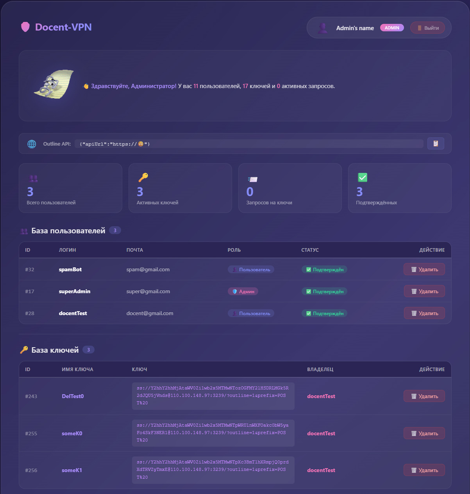
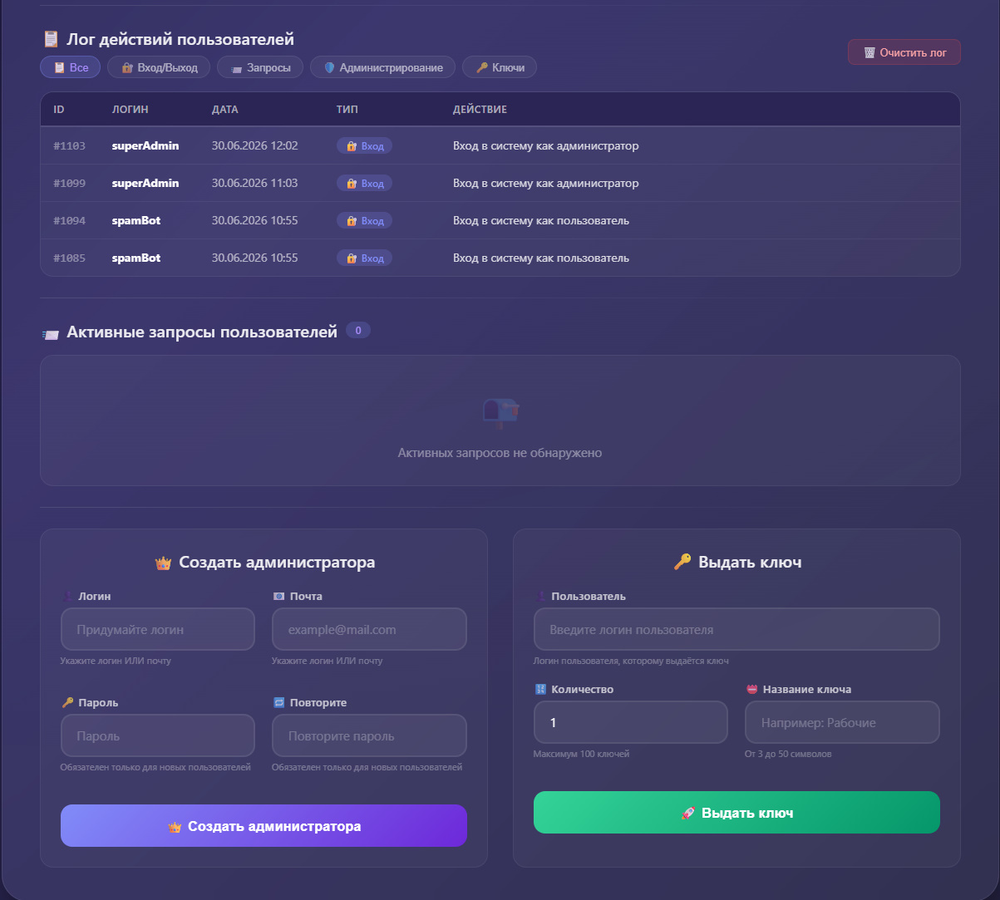
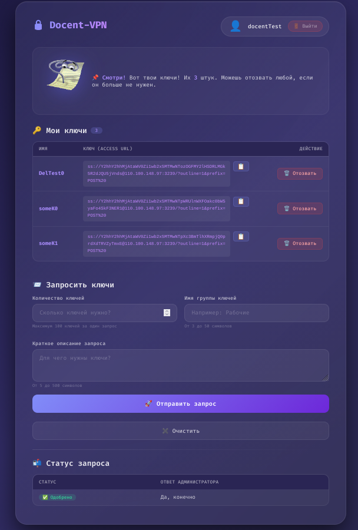

<div align="center">

# Docent-VPN - Веб-интерфейс для управления своим VPN-сервером

 [Требования](#Требования) • [Установка](#Установка) • [Конфигурация](#Конфигурация) • [Использование](#Веб-интерфейс)

 </div>


Данный проект представляет собой веб-интерфейс, позволяющий облегчить использование и администрирование своего VPN сервера на базе [Outline VPN от Jigsaw](https://github.com/OutlineFoundation/outline-apps).

### Содержание
- [Требования](#Требования)
- [Установка](#Установка)
- [Конфигурация](#Конфигурация)
- [Использование](#Веб-интерфейс)

## Требования
- Сервер на одном из дистрибутивов Linux (проверено на Ubuntu Server) 
- Git 
- Python3, Python3-venv, Python3-pip
- **(Опционально, нужно для работы двухэтапной аутентификации)** пароль приложения для почты

## Установка

Войдите на свой сервер (через ssh или любым другим удобным для вас способом) и установите все необходимые программы (см. [Требования](##Требования)).
> [!WARNING]
> Крайне желательно, что вы не выполняете все последующие действия непосредственно от **root пользователя**, а создали пользователя с правами администратора. Это можно сделать следующими командами:

``` 
adduser `имя_пользователя`
usermod -aG sudo имя_пользователя
```

Если вы используете **debian based** дистрибутив, то установить все требуемые программы можно через пакетный менеджер apt:

``` 
sudo apt update && sudo apt install git python3 python3-venv python3-pip
```


После этого выполните следующие команды:
``` 
cd ~/
git clone https://github.com/Docent681/docent-vpn
```

> [!WARNING]
> Крайне желательно клонировать репозиторий именно в домашнем каталоге. Клонирование в другие каталоги также предусматривается, но может вызвать ошибки в последующей работе веб-интерфейса

после этого запустите следующий скрипт с правами суперпользователя:

``` 
sudo ~/docent-vpn/setup.sh
```

Установка проходит в интерактивном режиме. У вас будет возможность:
- Настроить порты фаерволла
- Автоматически установить и настроить необходимые программы **(Outline Vpn, nginx, postgreSql)**
- Настроить окружение python
- Создать пользователя для базы данных, создать аккаунт администратора веб-интерфейс
- Настроить рассылку писем

> [!IMPORTANT]
> Веб-интерфейс использует рассылку писем для двухэтапной аутентификации пользователей при регистрации. Однако, если провайдеры сети, в которой находится ваш сервер, блокируют трафик smtp запросов, двухэтапная аутентификация будет выключена

В случае возникновения ошибок при установке сервиса подробности можно будет просмотреть в файле `installation.log` в корне проекта.

По итогам успешной установки будет выведена основная информация о вашем сервере Outline:
- Ip сервера
- Пользовательский и служебный порты
- ApiUrl для Outline

## Конфигурация

После установки для веб-интерфейса будет создана служба `docent-vpn` в `systemd`. При необходимости ее можно перезапускать командой:

``` 
sudo systemctl restart docent-vpn
```

Просмотреть статус работы веб-интерфейса можно командой:

``` 
sudo systemctl status docent-vpn
```

Основой конфиг веб-интерфейса - `envy.conf`. Заполняется в ходе установки через `setup.sh`, обладает следующими полями:
- `db_name` - название базы данных веб-интерфейса
- `db_username` - имя пользователя базы данных
- `email` - почта, через которую рассылаются коды двухэтапной аутентификации
- `email_password` - пароль приложения для почты
- `db_username_password` - пароль пользователя базы данных
- `secret_key` - секретный ключ для работы базы данных
- `is_mail_cooked 1` - флаг, который определяет, возможно ли обращение к smtp портам `(0-возможно/1-невозможно)`
- `api_url` - url, используемый Api Outline VPN
- `outline_secret_path` - Секретный ключ, используемый в Api Outline Vpn

При необходимости создания нового администратора веб-интерфейса можно воспользоваться следующим скриптом:

``` 
~/docent-vpn/add_admin.sh имя_пользователя имя_бд логин_нового_админа почта_нового_админа пароль_админа
```

Если вы захотите удалить docent-vpn со своего сервера, воспользуйтесь скриптом деинсталляции:

``` 
sudo ~/docent-vpn/uninstall.sh
```

## Веб-интерфейс




После установки можно использовать веб-интерфейс в вашем браузере, обратившись по Ip вашего сервера.

**Простые пользователи обладают следующим функционалом:**
- Просмотр и удаление имеющихся ключей
- Отправка запроса администраторам на получение ключей
- Просмотр ответов на запросы от администраторов

**Администраторы обладают следующим функционалом:**
- Просмотр базы пользователей, удаление пользователей
- Просмотр и удаление существующих ключей
- Просмотр истории действий пользователей **(в разработке)**
- Просмотр активных запросов пользоваетелей, автоматическое создание новых ключей для пользователей
- Создание новых администраторов, выдача прав администратора существующим пользователям
